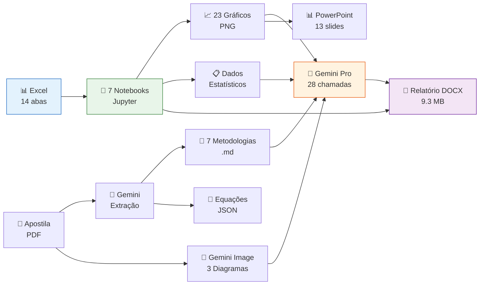
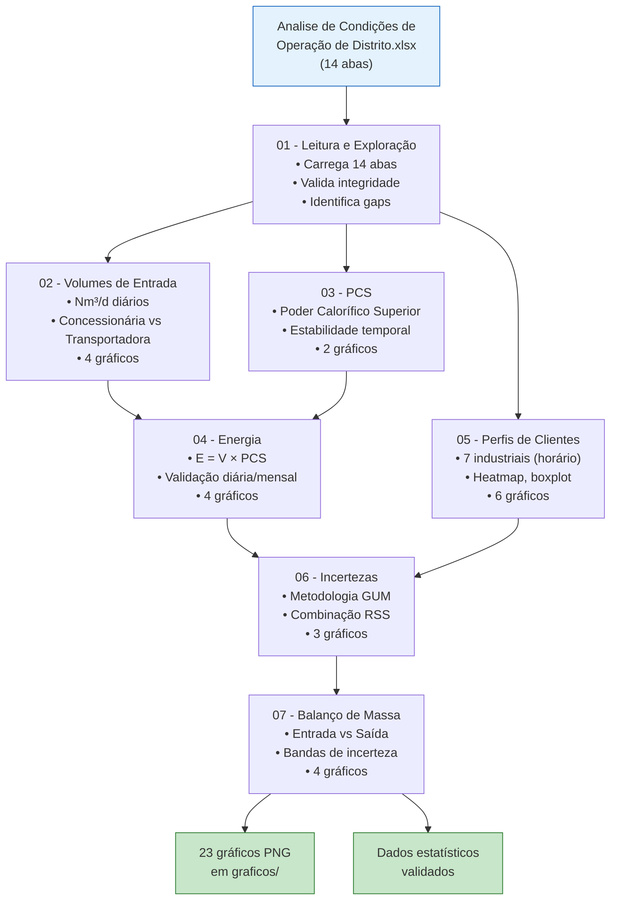
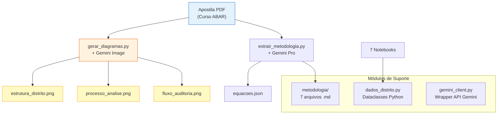
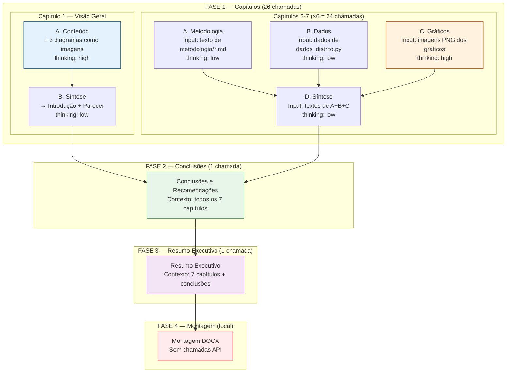
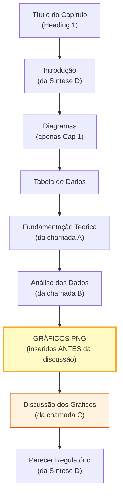
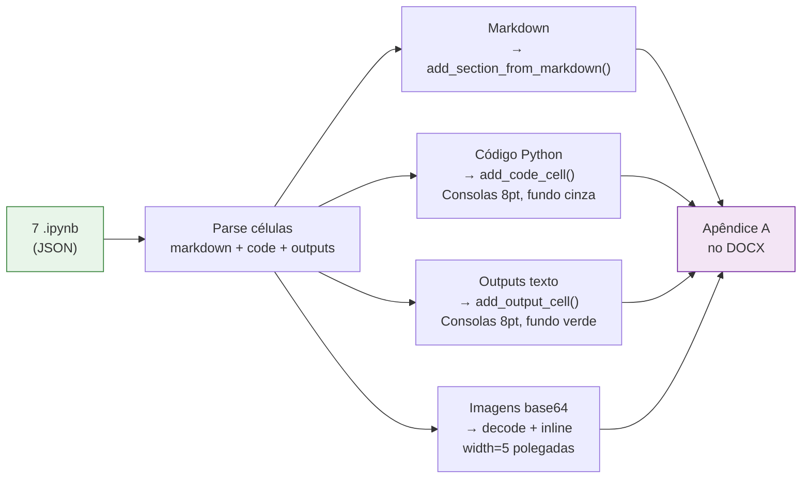
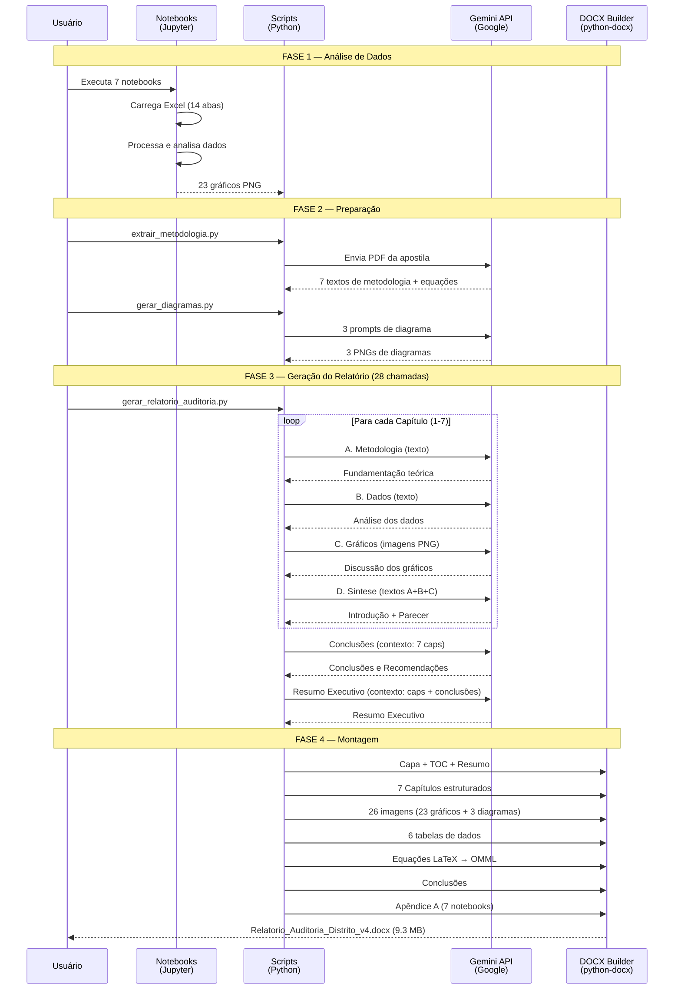

# Pipeline Completo — Auditoria de Medição de Gás Natural

**Projeto**: Curso ABAR — Medições Inteligentes e Gestão Integrada de Dados
**Período dos dados**: Abril a Setembro de 2025 (183 dias)
**Data de execução**: 11-12 de Fevereiro de 2026

---

## Visão Geral do Pipeline



---

## Cronologia Detalhada

### Fase 1 — Notebooks de Análise (11/fev)

**Objetivo**: Explorar, processar e analisar os dados brutos do Excel.



| # | Notebook | Conteúdo | Gráficos |
|:-:|----------|----------|:--------:|
| 1 | `01_leitura_e_exploracao.ipynb` | Carrega 14 abas, valida dados, identifica gaps (Coop Taxi 57% NaN) | 1 |
| 2 | `02_analise_volumes_entrada.ipynb` | Volumes diários Nm³/d, comparação Concessionária vs Transportadora | 4 |
| 3 | `03_analise_pcs.ipynb` | Poder Calorífico Superior — estabilidade, distribuição | 2 |
| 4 | `04_calculo_energia.ipynb` | E = V × PCS, validação de energia diária e mensal | 4 |
| 5 | `05_perfis_clientes.ipynb` | 7 clientes industriais — perfis horários, heatmap, boxplot | 6 |
| 6 | `06_sumario_e_incertezas.ipynb` | Incertezas GUM, combinação RSS por tramo e cliente | 3 |
| 7 | `07_balanco_massa.ipynb` | Balanço entrada vs saída com bandas de incerteza | 4 |

**Correções aplicadas**: Ajustes de `usecols`/`skiprows` na leitura do Excel, PCS com espaço no nome da coluna, incerteza 0.0109 vs 1.09%, waterfall com valores negativos, conversão `pd.to_numeric`.

---

### Fase 2 — Exportação de Gráficos e Apresentação (11-12/fev)


| Artefato | Descrição |
|----------|-----------|
| `graficos/` (23 PNGs) | `plt.savefig()` adicionado a cada gráfico dos notebooks |
| `gerar_apresentacao.py` | Script Python que gera PowerPoint automatizado |
| `Apresentacao_Curso_ABAR.pptx` | 13 slides com gráficos incorporados |
| `requirements.txt` | 11 dependências (pandas, numpy, matplotlib, openpyxl, python-pptx, etc.) |

---

### Fase 3 — Infraestrutura do Relatório (12/fev)

**Objetivo**: Preparar os módulos Python para geração automatizada do relatório DOCX via LLM.



| Arquivo | Função |
|---------|--------|
| `dados_distrito.py` | Dataclasses com dados estatísticos dos notebooks (volumes, PCS, energia, clientes, incertezas, balanço) |
| `gemini_client.py` | Wrapper da API Gemini — `analyze_section()` (texto+imagens+thinking) e `generate_image()` |
| `extrair_metodologia.py` | Extrai teoria da apostila PDF via Gemini → 7 `.md` + `equacoes.json` em `metodologia/` |
| `gerar_diagramas.py` | Gera 3 diagramas de processo via `gemini-3-pro-image-preview` → `diagramas/` |

**Modelos Gemini utilizados**:
- `gemini-3-pro-preview` — texto com thinking (análise de seções)
- `gemini-3-pro-image-preview` — geração de imagens (diagramas)

---

### Fase 4 — Relatório v1/v2 (12/fev)

**Objetivo**: Primeira geração do relatório (monolítica — 1 chamada LLM por seção).

| Arquivo | Função |
|---------|--------|
| `prompts_auditoria.py` | 9 templates de prompts para as seções |
| `docx_builder.py` | Construtor DOCX: capa, TOC, markdown→Word, equações LaTeX→OMML, tabelas, gráficos |
| `gerar_relatorio_auditoria.py` | Orquestrador: 9 chamadas Gemini → cache → montagem DOCX |

**Resultado**: `Relatorio_Auditoria_Distrito_v2.docx` — 9 seções, 6 tabelas, 23 gráficos, 3 diagramas, equações nativas Word (OMML).

**Problemas identificados na revisão**:
1. Seção 1 inventava 3 gráficos inexistentes (LLM nunca recebeu os diagramas)
2. Gráficos apareciam DEPOIS do texto que os referenciava
3. `clientes_heatmap.png` ausente do DOCX (enviado ao LLM mas não inserido)
4. Resumo Executivo gerado ANTES de Conclusões
5. Geração monolítica causando alucinações
6. Sem estrutura lógica Metodologia → Dados → Análise nos capítulos

---

### Fase 5 — Pipeline Segmentado v4 (12/fev)

**Objetivo**: Resolver os 6 problemas estruturais com geração segmentada.

#### Arquitetura Segmentada — 28 Chamadas LLM



#### Estrutura DOCX por Capítulo (ordem corrigida)



#### Problemas Corrigidos

| # | Problema | Solução |
|:-:|----------|---------|
| P1 | Seção 1 inventava 3 gráficos inexistentes | Diagramas passados como imagens ao LLM via `prompt_secao1_conteudo()` |
| P2 | Gráficos após o texto que os referencia | `add_chapter_structured()` insere gráficos ANTES da discussão |
| P3 | `clientes_heatmap.png` ausente do DOCX | Adicionado como Figura 5.4 no `CHAPTER_CONFIG` |
| P4 | Resumo Executivo gerado antes de Conclusões | Ordem: Capítulos → Conclusões → Resumo Executivo |
| P5 | Geração monolítica (1 chamada/seção) | 4 sub-chamadas por capítulo (segmentado) |
| P6 | Sem estrutura lógica nos capítulos | Ordem fixa: Metodologia → Dados → Gráficos → Síntese |

#### Arquivos Reescritos

| Arquivo | Mudança |
|---------|---------|
| `prompts_auditoria.py` | 6 system prompts especializados + `CHAPTER_CONFIG` dict + funções genéricas de prompt |
| `docx_builder.py` | `add_chapter_structured()` com ordem correta de elementos |
| `gerar_relatorio_auditoria.py` | `ChapterResult` dataclass, cache granular (28 .md), pipeline 4 fases |

#### Cache Granular

```
cache/
├── cap1_a_conteudo.md        # Cap 1 — Conteúdo (com diagramas)
├── cap1_b_sintese.md         # Cap 1 — Introdução + Parecer
├── cap2_a_metodologia.md     # Cap 2 — Fundamentação teórica
├── cap2_b_dados.md           # Cap 2 — Análise dos dados
├── cap2_c_graficos.md        # Cap 2 — Discussão dos gráficos
├── cap2_d_sintese.md         # Cap 2 — Introdução + Parecer
├── ...                       # (mesmo padrão para Cap 3-7)
├── cap7_d_sintese.md
├── conclusoes.md             # Conclusões e Recomendações
└── resumo_executivo.md       # Resumo Executivo
```

Permite `--resume` (retoma de onde parou) e `--montar` (remonta DOCX sem chamar API).

---

### Fase 6 — Apêndice com Notebooks (12/fev)

**Objetivo**: Incluir código-fonte e resultados dos 7 notebooks como anexo.



| Tipo de célula | Formatação no DOCX |
|----------------|-------------------|
| Markdown | Texto normal (headings, bullets, bold/italic) |
| Código Python | Consolas 8pt, fundo `#F5F5F5`, borda esquerda azul, label `In [N]:` |
| Saída texto | Consolas 8pt, fundo `#F0F8F0`, borda esquerda verde, label `Out:` |
| Imagem (gráfico) | Decodificada de base64, centralizada, width=5" |

---

## Produto Final

### Estrutura do Relatório DOCX (9.3 MB)

```mermaid
flowchart TD
    subgraph "Relatório_Auditoria_Distrito_v4.docx"
        CAPA["Capa"]
        TOC["Sumário"]
        RE["Resumo Executivo"]

        C1["Cap 1. Visão Geral do Distrito\n+ 3 diagramas"]
        C2["Cap 2. Análise de Volumes\n+ 4 gráficos"]
        C3["Cap 3. Análise do PCS\n+ 2 gráficos"]
        C4["Cap 4. Cálculo de Energia\n+ 4 gráficos"]
        C5["Cap 5. Perfis de Clientes\n+ 6 gráficos"]
        C6["Cap 6. Incertezas de Medição\n+ 3 gráficos"]
        C7["Cap 7. Balanço de Massa\n+ 4 gráficos"]

        CONC["Cap 8. Conclusões e\nRecomendações"]
        APX["Apêndice A\nCódigo e Resultados\ndos 7 Notebooks"]

        CAPA --> TOC --> RE
        RE --> C1 --> C2 --> C3 --> C4 --> C5 --> C6 --> C7
        C7 --> CONC --> APX
    end

    style CAPA fill:#1A237E,stroke:#0D47A1,color:#fff
    style RE fill:#E8F5E9,stroke:#2E7D32
    style CONC fill:#FFF3E0,stroke:#E65100
    style APX fill:#F3E5F5,stroke:#6A1B9A
```



### Inventário de Gráficos por Capítulo

| Capítulo | Gráficos | Arquivos |
|----------|:--------:|----------|
| Cap 1 | 3 diagramas | `estrutura_distrito.png`, `fluxo_auditoria.png`, `processo_analise.png` |
| Cap 2 | 4 | `vol_entrada_serie.png`, `vol_entrada_diferencas.png`, `vol_entrada_histograma.png`, `vol_entrada_boxplot.png` |
| Cap 3 | 2 | `pcs_serie.png`, `pcs_histograma.png` |
| Cap 4 | 4 | `energia_serie.png`, `energia_diferencas.png`, `energia_mensal.png`, `energia_scatter.png` |
| Cap 5 | 6 | `clientes_participacao.png`, `clientes_serie.png`, `clientes_perfil_horario.png`, `clientes_heatmap.png`, `clientes_pressao_temp.png`, `clientes_boxplot.png` |
| Cap 6 | 3 | `incertezas_barras.png`, `incertezas_rss.png`, `incertezas_contribuicao.png` |
| Cap 7 | 4 | `balanco_barras.png`, `balanco_waterfall.png`, `balanco_bandas.png`, `balanco_dashboard.png` |
| **Total** | **26** | 23 gráficos + 3 diagramas |

---

## Inventário Completo de Artefatos

| Tipo | Quantidade |
|------|:----------:|
| Notebooks Jupyter | 7 |
| Gráficos PNG | 23 |
| Diagramas PNG | 3 |
| Tabelas de dados no DOCX | 6 |
| Equações OMML nativas | ~30+ |
| Chamadas API Gemini (texto) | 28 |
| Chamadas API Gemini (imagem) | 3 |
| Arquivos Python | 8 |
| Arquivos de metodologia (.md) | 7 |
| Arquivos de cache (.md) | 28 |
| Relatório DOCX final | 9.3 MB |
| Apresentação PPTX | 13 slides |

---

## Arquivos Python do Projeto

```
📁 Cursos ABAR de Dados/
├── 📊 Analise de Condições de Operação de Distrito.xlsx   ← Dados brutos
├── 📖 APOSTILA COMPLETA_Curso ABAR_(...).pdf              ← Apostila teórica
│
├── 🐍 01_leitura_e_exploracao.ipynb     ← Notebook 1: Leitura
├── 🐍 02_analise_volumes_entrada.ipynb  ← Notebook 2: Volumes
├── 🐍 03_analise_pcs.ipynb             ← Notebook 3: PCS
├── 🐍 04_calculo_energia.ipynb         ← Notebook 4: Energia
├── 🐍 05_perfis_clientes.ipynb         ← Notebook 5: Clientes
├── 🐍 06_sumario_e_incertezas.ipynb    ← Notebook 6: Incertezas
├── 🐍 07_balanco_massa.ipynb           ← Notebook 7: Balanço
│
├── 🔧 dados_distrito.py          (~200 linhas)  Dataclasses com dados estatísticos
├── 🔧 gemini_client.py           (~150 linhas)  Wrapper API Gemini (texto + imagem)
├── 🔧 extrair_metodologia.py     (~100 linhas)  Extração de teoria do PDF
├── 🔧 gerar_diagramas.py         (~145 linhas)  Geração de diagramas via Gemini Image
├── 🔧 prompts_auditoria.py       (~450 linhas)  6 system prompts + CHAPTER_CONFIG
├── 🔧 docx_builder.py            (~920 linhas)  Construtor DOCX completo
├── 🔧 gerar_relatorio_auditoria.py (~400 linhas)  Orquestrador principal (pipeline)
├── 🔧 gerar_apresentacao.py      (~200 linhas)  Gerador de PowerPoint
├── 🔧 corrigir_notebooks.py      (~100 linhas)  Correções automatizadas
├── 📋 requirements.txt                          Dependências do projeto
│
├── 📁 graficos/        ← 23 PNGs exportados dos notebooks
├── 📁 diagramas/       ← 3 PNGs gerados pelo Gemini Image
├── 📁 metodologia/     ← 7 .md + equacoes.json extraídos do PDF
├── 📁 cache/           ← 28 .md (cache granular das chamadas LLM)
│
├── 📄 Relatorio_Auditoria_Distrito_v4.docx   ← PRODUTO FINAL (9.3 MB)
└── 📊 Apresentacao_Curso_ABAR.pptx           ← Apresentação (13 slides)
```

---

## Pipeline de Execução (Comandos)

```bash
# 1. Instalar dependências
pip install -r requirements.txt

# 2. Executar notebooks (gera gráficos em graficos/)
jupyter nbconvert --to notebook --execute 01_leitura_e_exploracao.ipynb
jupyter nbconvert --to notebook --execute 02_analise_volumes_entrada.ipynb
# ... (repetir para 03-07)

# 3. Extrair metodologia da apostila
python extrair_metodologia.py --api-key SUA_CHAVE_GEMINI

# 4. Gerar diagramas de processo
python gerar_diagramas.py --api-key SUA_CHAVE_GEMINI

# 5. Gerar relatório completo (28 chamadas API, ~18 min)
python gerar_relatorio_auditoria.py --api-key SUA_CHAVE_GEMINI

# 5b. Retomar de onde parou (usa cache)
python gerar_relatorio_auditoria.py --api-key SUA_CHAVE_GEMINI --resume

# 5c. Apenas remontar DOCX sem chamar API (usa cache completo)
python gerar_relatorio_auditoria.py --api-key SUA_CHAVE_GEMINI --montar

# 6. Gerar apresentação PowerPoint
python gerar_apresentacao.py
```

---

## Fluxo Completo End-to-End


